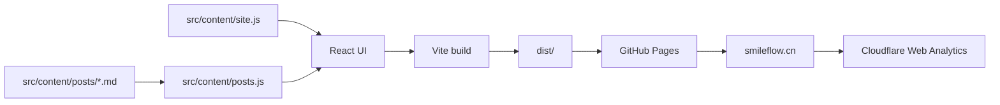

# 维护文档

这份文档面向后续维护者：改内容、发文章、调样式、上线前检查时先看这里。

## 一句话架构

这是一个纯静态 React + Vite 个人网站，没有后端。所有页面在浏览器里运行，部署时只把 `dist/` 发布到 GitHub Pages。



## 常用命令

```bash
npm install
npm run dev
npm run build
npm run preview
```

- `npm run dev`：本地开发，默认监听 `127.0.0.1`，端口通常从 `5173` 开始。
- `npm run build`：生产构建，输出到 `dist/`。
- `npm run preview`：本地预览生产构建结果。

上线前至少跑一次：

```bash
npm run build
```

## 代码结构

```text
src/
  App.jsx              页面区块、hash 路由、文章阅读器、动画入口
  MarkdownBody.jsx     Markdown 渲染器，懒加载，降低首屏 bundle 压力
  content/
    site.js            个人资料、项目、skills、渠道、联系文案
    posts.js           自动扫描并解析 posts/*.md
    posts/*.md         文章正文
  styles.css           全局样式、响应式布局、动效
public/
  assets/              头像、背景图等静态资源
index.html             HTML 入口、SEO meta、Cloudflare Analytics beacon
```

## 改站点内容

优先改 `src/content/site.js`，不要直接去组件里改文案。

常见字段：

- `profile`：姓名、邮箱、GitHub、X、hero 标语。
- `about`：About 区块的 bio 和规格信息。
- `endpoints`：外部分发平台和状态。
- `skills`：可复用方法论条目。
- `projects`：Build 区展示项目。
- `nowTraining`：正在准备的事项。
- `statusLines`：Contact 区循环状态文案。

标了 `[MOCK]` 的内容是占位，替换前要确认真实数据。

## 发文章

在 `src/content/posts/` 下新建 `.md` 文件。文件名默认就是 slug，也可以在 frontmatter 里显式写 `slug`。

示例：

```markdown
---
title: "文章标题"
slug: "my-post"
date: "2026-07-07"
type: "Essay"
adapter: "Agent Workflows"
summary: "列表和文章顶部显示的一句话摘要"
tags: ["Agents", "Product"]
readingTime: "6 min"
featured: true
status: "Published"
---

正文写 Markdown。
```

规则：

- 深链接格式是 `#post/<slug>`，例如 `https://smileflow.cn/#post/my-post`。
- 列表按 `date` 从新到旧排序。
- `featured: true` 会让文章成为默认展开候选；如果多个文章 featured，日期最新的优先。
- Markdown 支持 GFM，表格和代码块可用。

## 路由和交互

- 主导航使用普通 hash：`#about`、`#writing`、`#skills`、`#build`、`#contact`。
- 文章深链接使用 `#post/<slug>`。
- `src/App.jsx` 里有 `hashchange` 监听，负责在文章列表和阅读器之间切换。
- 文章阅读器使用 `AnimatePresence` 做进入/退出过渡。
- 页面滚动入场使用 `[data-reveal]` 和 `.revealed`，由 `IntersectionObserver` 控制。

## 动效约定

项目使用 `motion`，入口在 `src/App.jsx`：

```jsx
<LazyMotion features={domAnimation} strict>
```

因为开启了 `strict`，组件里要用 `m.*`，不要用 `motion.*`。

动效原则：

- UI 过渡控制在 300ms 内。
- 只优先动画 `transform` 和 `opacity`。
- 环境氛围类慢动画可以例外。
- 新增动画前先确认它是否帮助理解状态，而不是单纯装饰。

## 样式和设计

主要样式在 `src/styles.css`。

当前视觉方向来自 `docs/design-reference.md`：

- 暖羊皮纸背景，不用纯白。
- 标题偏 serif，UI 文案偏 mono。
- Lake Blue 是主强调色。
- 使用细边框和 pill button，不依赖重阴影。

新增 UI 时先复用现有 class 和布局模式，避免引入新的视觉体系。

## 流量统计

Cloudflare Web Analytics 已通过 `index.html` 接入：

```html
<script
  defer
  src="https://static.cloudflareinsights.com/beacon.min.js"
  data-cf-beacon='{"token": "..."}'
></script>
```

说明：

- 这个 token 是前端 public beacon token，不是后台密钥。
- DNS 仍在阿里云，站点仍部署在 GitHub Pages。
- Cloudflare 只负责统计基础访问数据。
- 管理后台入口不要写进公开文档；本机私有导航放在 `AGENTS.local.md`。

验证线上是否已加载：

```bash
curl -sS -L https://smileflow.cn/ | rg "cloudflareinsights|data-cf-beacon"
```

## 部署流程

推送到 `main` 后会自动触发：

```text
npm ci -> npm run build -> upload dist -> deploy GitHub Pages
```

配置文件：

```text
.github/workflows/deploy-pages.yml
```

GitHub Pages 设置：

```text
Source: GitHub Actions
Custom domain: smileflow.cn
Enforce HTTPS: enabled
```

## DNS

`smileflow.cn` 当前在阿里云 DNS，指向 GitHub Pages：

```text
@     A      185.199.108.153
@     A      185.199.109.153
@     A      185.199.110.153
@     A      185.199.111.153
www   CNAME  smilelikeye.github.io
```

预期：

```text
http://smileflow.cn/        -> https://smileflow.cn/
https://smileflow.cn/       -> 200
https://www.smileflow.cn/   -> https://smileflow.cn/
```

## 上线前检查清单

```bash
npm run build
git status --short --branch
```

必要时再检查：

```bash
curl -I -L https://smileflow.cn/
curl -I http://smileflow.cn/
curl -sS -L https://smileflow.cn/ | rg "cloudflareinsights|data-cf-beacon"
```

如果改了视觉或交互，至少本地打开页面检查：

- 桌面首屏是否正常。
- 移动端是否没有文字溢出。
- 文章深链接 `#post/<slug>` 是否能打开。
- 导航 hash 是否能滚到对应区块。

## 不要提交的本地文件

这些属于本机或构建产物，不要提交：

```text
AGENTS.local.md
dist/
node_modules/
.DS_Store
qa-*.png
qa-compare.html
```
